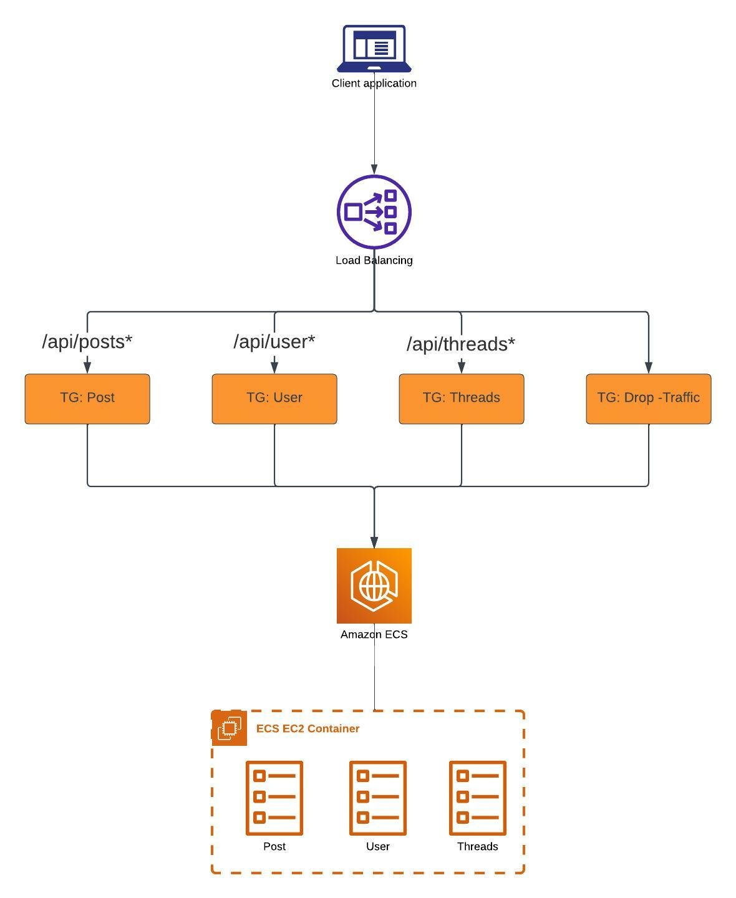

# ABOUT THIS ARCHITECTURE

This project is a micro service architecture which consists of
1. Amazon ECS - Running on EC2
2. Amazon ECR - 
3. Load Balancer -  To distribute Traffic to the various Micro service component based on Rules



# STEP TO CREATE THE PROJECT
We will be using only one component of the Micro services architect as we go through
the various stages of this text instructions BUT  kindly repeat same for the various components

In the step below I will be usings the "posts" services

1. Provision Amazon ECR Repositories https://console.aws.amazon.com/ecs/home?#/repositories to create
the various repository for the various component (posts, users, threads)
-- You can use the  "View push commands" button of the "posts" repository page to access all the necessary commands

2. Build and Push Images For each Services
In the project folder microservices/services you will have folders with files for each service.
You will need access to Docker to build and push the images for each service

 ```aws ecr get-login-password --region [your-region] | docker login --username AWS --password-stdin [aws_accountID].dkr.ecr.[your-region].amazonaws.com```

Build and Tag Each Image
```docker build -t posts .```
```docker tag posts:latest [aws_accountID].dkr.ecr.us-east-1.amazonaws.com/posts:latest```


